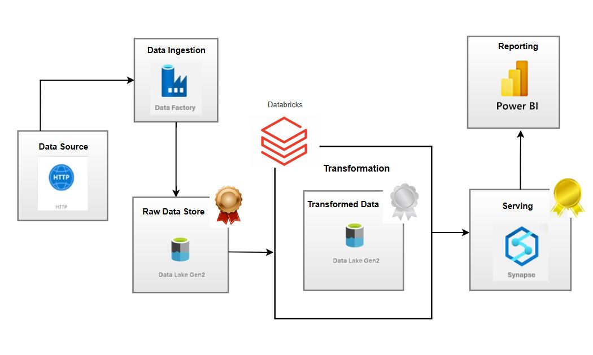

# 🧩 Azure Data Engineering Project: End-to-End ETL Pipeline

This project demonstrates a complete ETL pipeline using Microsoft Azure services, following the Medallion Architecture (Bronze → Silver → Gold). The goal was to implement real-world data engineering practices using the Azure ecosystem to ingest, transform, and visualize structured data for analytics.

─────────────────────────────────────────────────────────────────────────
## 🎯 Project Objective

To design and execute a scalable cloud data pipeline that:

- Ingests structured data from GitHub  
- Transforms it using Databricks and PySpark  
- Stores data using the Medallion Architecture in Azure Data Lake Gen2  
- Serves final analytical data via Synapse SQL  
- Visualizes insights in Power BI  

─────────────────────────────────────────────────────────────────────────
## 🧬 Architecture Overview

<pre> [GitHub CSV Files]
      |
      v
Azure Data Factory (Ingestion)
      |
      v
Azure Data Lake Storage Gen2
├── Bronze: Raw data (CSV files as-is)
├── Silver: Cleaned data via Databricks
└── Gold: Aggregated and analytical data
      |
      v
Azure Synapse Analytics (Serverless SQL)
      |
      v
Power BI (Interactive Dashboard) </pre>

─────────────────────────────────────────────────────────────────────────
## 🛠️ Tools & Technologies

| 🔧 Service/Tool              | 📌 Purpose                                                       |
|-----------------------------|------------------------------------------------------------------|
| Azure Data Factory          | Ingest GitHub CSVs into Bronze layer of ADLS Gen2               |
| Azure Data Lake Gen2        | Store structured data across Medallion layers                   |
| Azure Databricks            | PySpark transformations from Bronze → Silver → Gold             |
| PySpark                     | Distributed data processing and transformation                  |
| Azure Synapse SQL           | Create external tables on Gold data for querying                |
| Power BI                    | Visual analytics from Synapse tables (DirectQuery mode)         |

─────────────────────────────────────────────────────────────────────────
## 🗃️ Project Breakdown

### 1️⃣ Bronze Layer – Raw Ingestion

- GitHub CSV files copied via Azure Data Factory  
- Stored in `bronze/` container in ADLS in raw format  

### 2️⃣ Silver Layer – Transformation with PySpark

- Databricks reads raw CSVs: Sales, Customers, Products, Returns  
- Applied schema validation, filtering nulls, and renaming columns  
- Joined tables to enrich datasets (e.g., Sales with Products)  
- Cleaned data written to `silver/` container  

### 3️⃣ Gold Layer – Serving for Analytics

- Final enriched datasets written to `gold/` container as Parquet  
- Synapse SQL uses `CREATE EXTERNAL TABLE` to access Gold layer  
- Defined external file format and data source  

### 4️⃣ Power BI – Business Reporting

- Connected Synapse SQL to Power BI using DirectQuery  
- Created dashboard with:  
  - 📌 Total Customers (Card)  
  - 📈 Sales Trends (Line Chart)  
  - 📊 Revenue by Category (Bar & Pie)  
  - ⭐ Top Products (Ranked Bar Chart)  

─────────────────────────────────────────────────────────────────────────
## 🎓 Key Learning Outcomes

- Applied **Medallion Architecture** in a structured Azure pipeline  
- Used OAuth to securely connect ADLS and Databricks  
- Built **external tables** in Synapse for serverless querying  
- Combined all services into a **Power BI dashboard** for reporting  
- Understood data engineering flow from raw → trusted → curated  

─────────────────────────────────────────────────────────────────────────
## 📷 Visual Highlights

### 🔹 Azure Data Pipeline Flow

─────────────────────────────────────────────────────────────────────────
## 🌟 Reflection

This project was a complete cloud-based data engineering journey. From ingesting real data into Azure to delivering a live analytics dashboard, it captures the typical tasks handled by a modern Data Engineer. It also strengthened my understanding of distributed computing using PySpark and the integration capabilities within the Microsoft Azure ecosystem.

─────────────────────────────────────────────────────────────────────────
## 👤 Author

**Name:** Sumit Chhillar  
**LinkedIn:** [linkedin.com/in/sumit-chhillar-020a36323](https://www.linkedin.com/in/sumit-chhillar-020a36323)  
**Email:** sumitchhillar1706@gmail.com  
